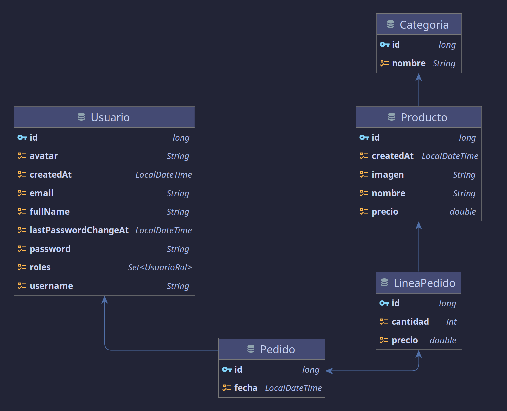

# Kotlin SpringBoot  REST Service

Servicio web para API REST con Kotlin y SpringBoot.

[](https://kotlinlang.org/)
[](https://spring.io)
[]()


- [Kotlin SpringBoot  REST Service](#kotlin-springboot--rest-service)
  - [Acerca de](#acerca-de)
  - [Diseño](#diseño)
    - [Modelo](#modelo)
  - [Postman](#postman)
  - [Endpoints](#endpoints)
    - [Categorías](#categorías)
      - [Get all items](#get-all-items)
      - [Get item](#get-item)
      - [Post item](#post-item)
      - [Put item](#put-item)
      - [Delete item](#delete-item)
    - [Pedidos](#pedidos)
      - [Get all items](#get-all-items-1)
      - [Get item](#get-item-1)
      - [Post item](#post-item-1)
      - [Put item](#put-item-1)
      - [Delete item](#delete-item-1)
      - [Get all lineas](#get-all-lineas)
      - [Post linea](#post-linea)
      - [Put linea](#put-linea)
      - [Delete linea](#delete-linea)
    - [Productos](#productos)
      - [Get all items](#get-all-items-2)
      - [Get item](#get-item-2)
      - [Post item](#post-item-2)
      - [Put item](#put-item-2)
      - [Delete item](#delete-item-2)
    - [Storage](#storage)
      - [Get item](#get-item-3)
      - [Post item](#post-item-3)
    - [Usuarios](#usuarios)
      - [Post item](#post-item-4)
      - [Get mi info. **Requerido JWT token**](#get-mi-info-requerido-jwt-token)
      - [Do login](#do-login)
      - [Get mi pedidos. **Requerido JWT token**](#get-mi-pedidos-requerido-jwt-token)
    - [Auth](#auth)
  - [Autor](#autor)
    - [Contacto](#contacto)
  - [Licencia](#licencia)

## Acerca de

Este proyecto tiene como objetivo una API REST con Kotlin y SpringBoot. Para ello nos basaremos
en[ proyectos similares realizados](https://github.com/search?q=user%3Ajoseluisgs+rest).

Para el almacenamiento de la información se ha usado una H2 Database. El procedimiento y explicación de los contendidos
de Spring/Springboot y JPA usados, así como otras técnicas queda descrito
en [este proyecto de 2DAM](https://github.com/joseluisgs/SpringBoot-Productos-DAM-2021-2022).

Como mecanismos de autenticación y autorización se ha usado JWT Tokens.

El objetivo de este proyecto es que se pueda realizar una API REST con Kotlin y con ello ver las diferencias y
similitudes respecto a relanzarlo con JAVA o otros Frameworks,
como [Ktor](https://github.com/joseluisgs/Kotlin-Ktor-REST-Service).


## Diseño
Esta didáctica API REST se ha diseñado para que sea más fácil de entender y de usar y ayudar al alumnado a usar Spring Boot con Kotlin. El objetivo es realizar un proyecto muy similar a los vistos en clase con este potente lenguaje que agiliza el desarrollo de aplicaciones para Backend.

A lo largo de este proyecto veremos como crear un servicio REST y con ello desarrollar modelos mediante JPA, repositorios para realizar operaciones CRUD, servicios de subida de ficheros, mecanismos de seguridad: autenticación y autorización con JWT. Siempre haciendo hincapié en las bondades que nos ofrece Kotlin y recurriendo lo menos posible a librerías de terceros como quizás si hagamos en Java. Finalmente se ha han realizado algunos ejemplos de resteo usando JUnit y Mockito tanto a nivel unitario como de integración.

### Modelo
El modelado de la información sigue este diagrama: 



## Postman
Se ofrece un [fichero en Postman](./postman/Kotlin-SpringBoot-Rest.postman_collection.json) para que consultes y juegues con la API.

## Endpoints
Puedes consultar los Enpoints en la documentación: http://localhost:6969/swagger-ui/index.html
### Categorías

#### Get all items

```http
  GET /rest/categorias
```

#### Get item

```http
  GET /rest/categorias/${id}
```

#### Post item
```http
  POST /rest/categorias/
```

#### Put item
```http
  PUT /rest/categorias/${id}
```

#### Delete item
```http
  DELETE /rest/categorias/${id}
```

### Pedidos

#### Get all items

```http
  GET /rest/pedidos
```

#### Get item

```http
  GET /rest/pedidos/${id}
```

#### Post item
```http
  POST /rest/pedidos/
```

#### Put item
```http
  PUT /rest/pedidos/${id}
```

#### Delete item
```http
  DELETE /rest/pedidos/${id}
```

#### Get all lineas
```http
  GET /rest/pedidos/${id}/lineas
```

#### Post linea
```http
  POST /rest/pedidos/${id}/lineas
```

#### Put linea
```http
  PUT /rest/pedidos/${id}/lineas/${idLinea}
```

#### Delete linea
```http
  DELETE /rest/pedidos/${id}/lineas/${idLinea}
```

### Productos

#### Get all items

```http
  GET /rest/productos
```

#### Get item

```http
  GET /rest/productos/${id}
```

#### Post item
```http
  POST /rest/productos/
```

#### Put item
```http
  PUT /rest/productos/${id}
```

#### Delete item
```http
  DELETE /rest/productos/${id}
```
### Storage

#### Get item

```http
  GET /rest/storage/${name}
```

#### Post item
```http
  POST /rest/storage/
```

### Usuarios

#### Post item
```http
  POST /rest/usuarios/
```

#### Get mi info. **Requerido JWT token**
```http
  GET /rest/usuarios/me
```

#### Do login
```http
  GET /rest/usuarios/login
```

#### Get mi pedidos. **Requerido JWT token**
```http
  GET /rest/usuarios/me/pedidos
```

### Auth
Replican los endpoint anteriores pero con reglas de autenticación y autorización usando JWT tokens: **Requerido JWT token**

```kotlin
POST "/usuarios/**" -> "USER", "ADMIN"
GET "/auth/categorias/**" -> "USER", "ADMIN"
POST "/auth/categorias/**" -> "ADMIN"
PUT "/auth/categorias/**" -> "ADMIN"
DELETE "/auth/categorias/**" -> "ADMIN"
GET "/auth/productos/**" -> "USER", "ADMIN"
POST "/auth/productos/**" -> "ADMIN"
PUT "/auth/productos/**" -> "ADMIN"
DELETE "/auth/productos/**" -> "ADMIN"
GET "/auth/pedidos/**" -> "ADMIN"
POST "/auth/pedidos/**" -> "ADMIN"
PUT "/auth/pedidos/**" -> "ADMIN"
DELETE "/auth/pedidos/**" -> "ADMIN"
GET "/auth/user/pedidos/**" -> "USER"
POST "/auth/user/pedidos/**" -> "USER"
PUT "/auth/user/pedidos/**" -> "USER"
DELETE "/auth/user/pedidos/**" -> "USER"
```

## Autor

Codificado con :sparkling_heart: por [José Luis González Sánchez](https://twitter.com/joseluisgonsan)

[](https://twitter.com/joseluisgonsan)
[](https://github.com/joseluisgs)

### Contacto

<p>
  Cualquier cosa que necesites házmelo saber por si puedo ayudarte 💬.
</p>
<p>
    <a href="https://twitter.com/joseluisgonsan" target="_blank">
        
    </a> &nbsp;&nbsp;
    <a href="https://github.com/joseluisgs" target="_blank">
        
    </a> &nbsp;&nbsp;
    <a href="https://www.linkedin.com/in/joseluisgonsan" target="_blank">
        
    </a>  &nbsp;&nbsp;
    <a href="https://joseluisgs.github.io/" target="_blank">
        
    </a>
</p>

## Licencia

Este proyecto está licenciado bajo licencia **MIT**, si desea saber más, visite el fichero [LICENSE](./LICENSE) para su
uso docente y educativo.